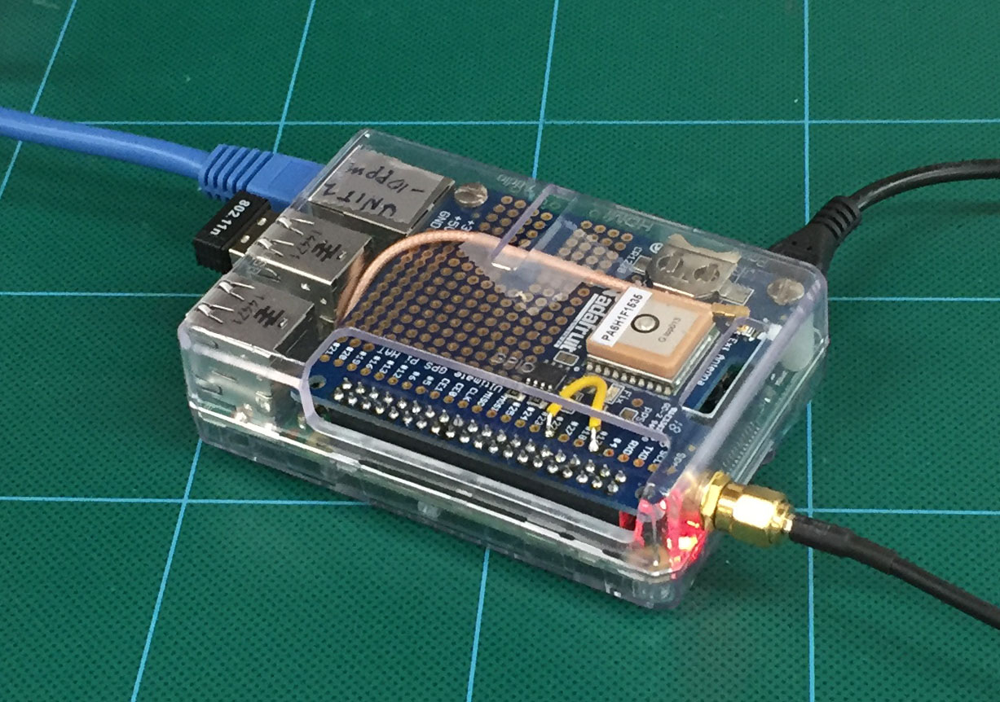
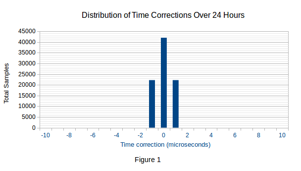
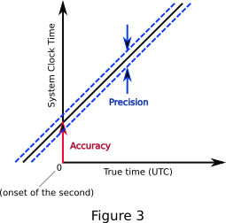
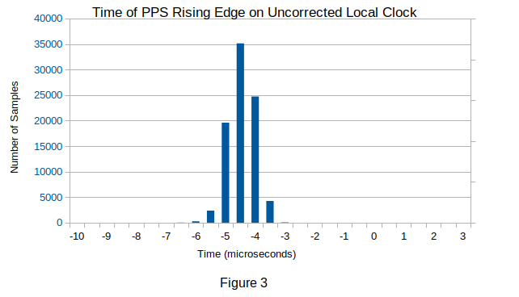
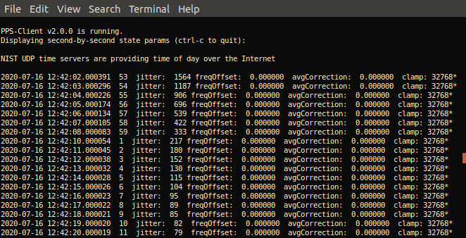

# PPS-Client v2.0.4

<p align="center"></p>

The PPS-Client daemon is a fast, microsecond accuracy Pulse-Per-Second system clock synchronizer for application processors that synchronizes the system time to GPS time from the PPS signal provided by a GPS reciever. 

- [Summary](#summary)
- [Hardware Requirements](#hardware-requirements)
- [Software Requirements](#software-requirements)
  - [Operating System](#operating-system)
  - [Support Applications](#support-applications)
- [Installing](#installing)
  - [Verify PPS Reception](#verify-pps-reception)
  - [Enable the Driver](#enable-the-driver)
  - [NIST Time Server](#nist-time-server)
  - [GPS Time](#gps-time)
- [Uninstalling](#uninstalling)
- [Reinstalling](#reinstalling)
- [Running PPS-Client](#running-pps-client)
  - [Hot Restart](#hot-restart)
  - [Restart on System Boot](#restart-on-system-boot)
- [Addendum](#addendum)

# Summary
---
The PPS-Client daemon provides the time keeping precision of a *timeline* with a standard deviation of 0.6 to 0.9 microsecond on Raspberry Pi and a typical time keeping accuracy of 2 microseconds on Linux processors with operating systems that provide the Linux pps-gpio or pps-ldisc driver. Precision and accuracy at this level is possible because the PPS-Client controller uses design techniques not previously used to discipline an application processor clock to a PPS signal.

The daemon can provide a continuous second by second display of its current timekeeping parameters so that its ongoing timekeeping performance can be inspected at any time (see the figures in [Running PPS-Client](#running-pps-client)). This is a convenient way of tracking the performance of a system claiming to discipline a clock to a PPS signal.

The PPS-client controller does not require precision temperature control. The following results were recorded while the test unit was in a partially heated room where the temperature varied over a range of about 60 to 75 deg F through 24 hours. 

Figure 1 is a distribution of time corrections made by the PPS-Client controller to the system clock. 

<p align="center"></p>

This data was captured from a Raspberry Pi 4 running Raspberry Pi OS on a standard 4.19.118-v7l+ Linux kernel. These were the corrections for each second that were made to the *timeline*, defined as the reported time at each instant of time on the local clock, to keep the *timeline* synchronized to the PPS interrupt. 

The *timeline* is not straight. Because of continuous small variations in the frequency of the clock oscillator ([flicker noise](https://en.wikipedia.org/wiki/Flicker_noise)), the *timeline* moves randomly above and below an ideal straight line over an interval of one second. The randomness makes it necessary to characterize the *timeline* as a random variable. It is normally distributed and readily measured on any processor. 

The time corrections required to keep the *timeline* synchronized to the rising edge of the PPS signal never exceeded 1 microsecond in this 24 hour period. Consequently, the *timeline* was continuously synchronized to the PPS over 24 hours and can be continuously synchronized indefinitely. This was true for twenty Raspberry  Pi units that were tested. 

That *timeline* test data shows that the **precision** (Figure 2) of the time is a *timeline* with a standard deviation of 0.6 microsecond for a sample size of ten RPi4 units and an SD of 0.9 microsecond for a sample size of ten RPi3 units.

As shown in the same figure, timekeeping **accuracy** is the time offset at the rollover of the second which is also the offset between the true time and the measured time at any point in time.

<p align="center"></p>

Establishing accuracy is more complicated than establishing precision. However, it is possible to precisely measure the location of the rising edge of the PPS signal *in software*. That was done for twenty Raspberry Pi processors - ten RPi3 units and ten RPi4 units to determine default correction values to be automatically used for these processors. Figure 3 is the calibration result for one of the RPi4 processors, selected at random:

 
 <p align="center"></p>
 

Figure 3 shows the time errors in 86,400 time samples collected over 24 hours for this particular processor. The center of the distribution is at -4.42 microseconds on an uncorrected local clock. The rounded value of 4 microseconds was subsequently used as a correction value for this clock. 

For a detailed description of the PPS-Client controller and accuracy calibration, please run Doxygen in `/usr/share/doc/pps-client` to generate the documentation or visit the [PPS-Client-Pages](https://rascol.github.io/html/) website.

# Hardware Requirements
---

1. A Raspberry Pi 2, 3 or 4 B or B+ or an AMD/Intel desktop system.


2. A GPS module that provides a PPS output. Development was done with the [Adafruit Ultimate GPS module](https://www.adafruit.com/products/2324). Others providing compatible logic levels can also be used.


3. A wired connection from the PPS source to a suitable GPIO pin on the processor or to the DCD pin of a serial port for processors that do not have GPIO connectivity. For the Raspberry Pi this is GPIO 4 (pin 7) on the RPi header.

 
# Software Requirements
---

## Operating System

Versions of Linux kernel 4.19 and later are supported. Currently PPS-Client v2.0 is known to run on **Raspbian**, **Raspberry Pi OS** and **StellarMate OS** on the Raspberry Pi and on **Ubuntu** 18.04 on an AMD desktop machine.

## Support Applications

The OS must provide the `systemd` system services manager or it must be possible to install it. 

The OS must also provide either the LinuxPPS `pps-gpio` or `pps-ldisc` driver. The `gps-gpio` driver is used if the PPS signal is connected to a GPIO pin. The `pps-ldisc` driver is used when the PPS signal is connected to the DCD line of a serial port. The Raspberry Pi uses the `pps-gpio` driver as described below in [Installing](#installing).


# Installing
---

Installation of PPS-Client no longer requires installing the Linux kernel because PPS-Client now uses the LinuxPPS drivers provided by the Linux OS. In principle, that makes it possible to install PPS-Client on any Linux system. In practice, many of the small ARM processors do not provide adequate driver or OS support. On the other hand, PPS-Client currently runs on an ARM processor, the Raspberry Pi, and on a desktop machine with an AMD processor running Ubuntu 18.04. This section will provide the details for installation on a Raspberry Pi.

## Verify PPS Reception

The very first thing to do before you begin installing is to verify that your gps receiver is decoding the PPS signal. This should be obvious but it is easy to overlook. The Adafruit GPS Module provides a blinking red light. While the module is attempting to acquire the light blinks about once per second. Once the module has acquired, the light blinks about once every fifteen seconds. Other GPS modules may use a different method.

## Enable the Driver

Specifically for the Raspberry Pi, enable the PPS in the system hardware configuration file:

```
~ $ sudo nano /boot/config.txt
```
Add these lines at the end of the file:

```
#Name:   pps-gpio
#Info:   Configures the pps-gpio (pulse-per-second time signal via GPIO).
#Load:   dtoverlay=pps-gpio,<param>=<val>
#Params: gpiopin                 Input GPIO (default 18)
#        assert_falling_edge     When present, assert is indicated by a falling
#                                edge, rather than by a rising edge
# dtoverlay=pps-gpio,gpiopin=4,assert_falling_edge
# The gpiopin value specifies the interrupt number not the pin number.
# Also this overlay will cause pps-gpio to auto load at boot.
dtoverlay=pps-gpio,gpiopin=4
```

Then ctrl-o and the enter key to save the file. ctrl-x to exit. Now reboot the Pi to make these additions effective,

```
~ $ sudo reboot
```

To continue, we will need a few software packages,

```
~ $ sudo apt install git pps-tools build-essential
```

The pps-tools package provides a test to verify that the PPS signal is present,

```
~ $ sudo ppstest /dev/pps0
```

If you are receiving a PPS signal you will see something like this (with a ctrl-c to stop),

```
found PPS source "/dev/pps0"
ok, found 1 source(s), now start fetching data...
source 0 - assert 1585766996.007889923, sequence: 257813 - clear  0.000000000, sequence: 0
source 0 - assert 1585766997.007743365, sequence: 257814 - clear  0.000000000, sequence: 0
source 0 - assert 1585766998.007606702, sequence: 257815 - clear  0.000000000, sequence: 0
source 0 - assert 1585766999.007471245, sequence: 257816 - clear  0.000000000, sequence: 0
source 0 - assert 1585767000.007339597, sequence: 257817 - clear  0.000000000, sequence: 0
source 0 - assert 1585767001.007208127, sequence: 257818 - clear  0.000000000, sequence: 0
^C
```

If that was successful, you can download the PPS-Client code.

```
~ $ mkdir rpi
~ $ cd rpi
~/rpi $ git clone --depth=1 https://github.com/rascol/PPS-Client;
```

Go into the PPS-Client directory.

```
~/rpi $ cd PPS-Client
```

On initial installation, create backups of files that will be modified during the build,

```
~/rpi/PPS-Client $ ./create-backups
```

That command isn't necessary if you recompile and reinstall later with the same source files. Now you can do the standard install:

```
~/rpi/PPS-Client $ make
~/rpi/PPS-Client $ sudo make install
~/rpi/PPS-Client $ sudo reboot

```

## NIST Time Server

The default setup for PPS-Client is to use NIST time servers over the Internet to provide the whole second wallclock time. If you are satisfied with that you are done.

## GPS Time

PPS-Client can also be configured to have the GPS receiver that is providing the PPS signal also provide the whole-second time of day updates as well. This allows operation with no Internet connection. A Raspberry Pi configured this way could, for example, be used as a Stratum 1 time server for a LAN that is not connected to the Internet.

GPS time can be configured with no additional hardware connections if the [Adafruit Ultimate GPS module](https://www.adafruit.com/products/2324) (visible in the picture at the top) is used because this device connects directly to the serial port of the RPi through its GPIO pins. With other GPS receivers, you might have to separately make the serial port connections.

To configure GPS time, first make the serial port on the RPi available to be used by the GPS receiver,

```
~ $ sudo raspi-config
```

Scroll down to "Interface Options" and in that menu select "Serial Port". Set "No" for a login shell and "Yes" for the serial port hardware to be enabled. Reboot the RPi. 

Test that you are receiving GPS serial data. The serial port that is used will usually be **/dev/ttyS0**. You can check that with,

```
~ $ cat /dev/ttyS0
```

You should see a stream of GPS data. Stop it with ctl-c. If you don't get it, try nearby serial ports. Those can be seen with,

```
~ $ ls -l /dev/tty*
```

The serial port that is providing the serial data will be a serial port that has group "dialout".

Finally, set serial mode operation in PPS-Client with,

```
~ $ sudo nano /etc/pps-client.conf
```

Scroll down to the line,

```
#serial=enable
```

and uncomment it. Then save the file (ctl-o, enter, ctl-x).

That will set PPS-Client to read GPS time messages from the serial port. This, of course, requires that the GPS receiver is connected to the serial port of the Raspberry Pi and that the serial port has been set for this purpose. 

# Uninstalling
---

Uninstall PPS-Client on the RPi with:

```
~ $ sudo pps-client-stop
~ $ sudo pps-client-remove
```

This removes everything **except** the configuration file which you might want to keep if it has been modified and you intend to reinstall PPS-Client. A reinstall will not replace a PPS-Client configuration file, **/etc/pps-client.conf** from the same major release, that has been modified. However, if the pps-client.conf is from an earlier major release, it won't be compatible with this release. In that case the file will be replaced but the previous file will be saved to **/etc/pps-client.conf.old**.

To remove everything do:

```
~ $ sudo pps-client-remove -a
```

# Reinstalling
---

To reinstall, or to install a new version of PPS-Client over an old version, first uninstall as [described above](#uninstalling) then install as in [Installing](#installing). If you kept a modified **/etc/pps-client.conf** file, the new install will **not** replace it. Instead the new config file will be copied to **/etc/pps-client.conf.default** to give you the choice of replacing it later.

If you are reinstalling a PPS-Client package that you previously compiled,

```
~/rpi/PPS-Client $ make clean
~/rpi/PPS-Client $ make
~/rpi/PPS-Client $ sudo make install
~/rpi/PPS-Client $ sudo reboot

```
# Running PPS-Client
---

The PPS-Client daemon should be launched with systemctl. Once the GPS is connected and the PPS signal is present on GPIO 4 you can start PPS-Client with,

```
~ $ sudo systemctl start pps-client
```

That installs PPS-Client as a daemon. To stop PPS-Client

```
~ $ sudo systemctl stop pps-client
```

After starting PPS-Client, wait for several seconds to allow the start command to complete. 

Then to watch the controller acquire you can enter,

```
~ $ pps-client -v
```

That runs a second copy of PPS-Client that just displays a status printout that the PPS-Client daemon continuously generates and saves to an in-memory file. When PPS-Client starts up you can expect to see something like the following in the status printout:

<p align="center"></p>

The `jitter` value is showing the fractional second offset of the PPS signal according to the system clock. That value will decrease second by second as the controller locks to the PPS signal. Within 10 to 20 minutes the status printout will look like this:

<p align="center"></p>

The `jitter` is displaying small numbers. The time of the rising edge of the PPS signal is shown in the second column. The `clamp` value on the far right indicates that the maximum time correction applied to the system clock is being limited to one microsecond. The system clock is synchronized to the PPS signal to a precision of one microsecond.

It can take as long as 20 minutes for PPS-Client to fully acquire the first time it runs (but it can also restart immediately - [see below](#restarting)). This slow startup happens if the `jitter` shown in the status printout is on the order of 100,000 microseconds or more. It's quite common for the NTP fractional second to be off by that amount on a cold start. In this case PPS-Client may restart several times as it slowly reduces the `jitter` offset. That happens because system functions that PPS-Client calls internally limit time changes to less than about 500 microseconds in each second.

These are the parameters shown in the status printout:

 * First two columns - date and time of the rising edge of the PPS signal.
 * Third column - the sequence count, i.e., the total number of PPS interrupts received since PPS-Client was started.
 * jitter - the time deviation in microseconds recorded at the reception of the PPS interrupt.
 * freqOffset - the correction offset that is applied to the system clock, in parts per million of the system clock frequency, that is required to keep it synchronized to the PPS signal.
 * avgCorrection - the second-by-second average over the previous minute of the time correction (in parts per million) that is applied once per minute to the system clock.
 * clamp - the hard limit (in microsecs) applied to the raw time error to convert it to a time correction.

To stop the display type ctrl-c.

The daemon will continue to run until you reboot the system or until you stop the daemon.

## Hot Restart

If PPS-Client has been running long enough that it has acquired the PPS signal and is delivering status messages and you have to stop the daemon for some reason but don't reboot, then if you restart PPS-Client within the next few minutes the daemon will resume from where it left off when you stopped it. How well this works will depend on how long the delay is between stopping and restarting because of clock drift. If the clock drifts too much then PPS-Client will do a full restart.

## Restart on System Boot

To have PPS-Client start up on every system boot,

```
~ $ sudo systemctl stop pps-client
~ $ sudo systemctl enable pps-client
```

If the enable command was sucessful you will get a success message from *systemctl*. Then start pps-client again,

```
~ $ sudo systemctl start pps-client
```

Now **wait about ten seconds** before you verify that PPS-Client is running with,

```
~ $ pps-client -v
```

Once the command above starts delivering status messages you can reboot to verify that ppa-client will automatically restart. On an immedate reboot you might again have to wait about ten seconds before the command above starts delivering status messages.

However, **on a cold start you might have to wait for several minutes** for the GPS receiver to acquire the GPS signal before the comand above will deliver status messages. 

# Addendum

The preferred method of running PPS-Client is to use *systemctl*. However the old method of running is still possible and might occasionally be necessary: To start PPS-Client,

```
~ $ sudo pps-client &
```

Notice the use of the ampersand to detach PPS-Client from the terminal window. That is a consequence of no longer explicitly forking PPS-Client as a daemon. That operation is handled best by *systemctl*.

To stop PPS-Client,

```
~ $ sudo pps-client-stop
```

Those are the apps that *systemctl* calls under the hood. If you use them, you will, of course, have to restart PPS-Client manually each time you reboot.

Finally, if you believe you have done everything correctly and things are still not working correctly try rebooting. 


